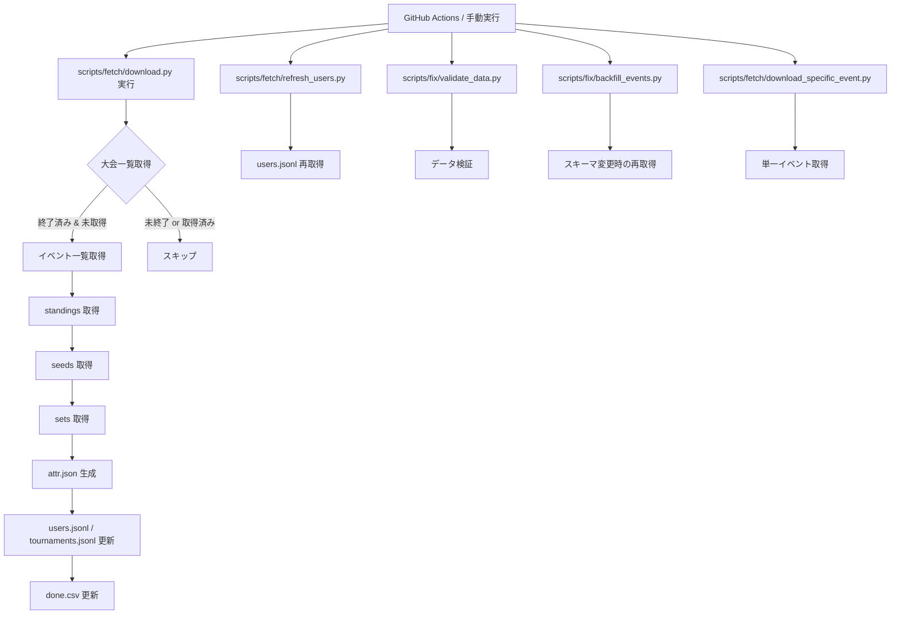

# Flow

## 全体の流れ（Mermaid）

```mermaid
flowchart TD
    A[GitHub Actions / 手動実行] --> B[scripts/fetch/download.py 実行]
    B --> C{大会一覧取得}
    C -->|終了済み & 未取得| D[イベント一覧取得]
    D --> E[standings 取得]
    E --> F[seeds 取得]
    F --> G[sets 取得]
    G --> H[attr.json 生成]
    H --> I[users.jsonl / tournaments.jsonl 更新]
    I --> J[done.csv 更新]

    C -->|未終了 or 取得済み| K[スキップ]

    A --> L[scripts/fetch/refresh_users.py]
    L --> M[users.jsonl 再取得]

    A --> N[scripts/fix/validate_data.py]
    N --> O[データ検証]

    A --> P[scripts/fix/backfill_events.py]
    P --> Q[スキーマ変更時の再取得]

    A --> R[scripts/fetch/download_specific_event.py]
    R --> S[単一イベント取得]
```

## GitHub Actions の位置づけ
- 入口は GitHub Actions（定期実行/手動）またはローカル実行。
- 収集は `scripts/fetch/download.py` を基本とし、必要に応じて欠損補完・個別取得を追加で呼ぶ。
- 生成物は `data/` に保存され、コミットするかアーティファクト化する想定。
